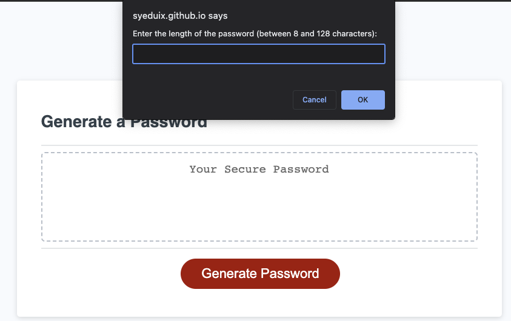

# Password Generator JavaScript

## Description

A password generator is a web-based tool designed to generate unique and random passwords in accordance with recommended security standards. It produces robust, random, and secure passwords, enhancing your online safety.

## Mock-Up

The following image shows the web application's appearance and functionality:

## Instruction

- Generate a password when the button is clicked
  - Present a series of prompts for password criteria
    - Length of password
      - At least 8 characters but no more than 128.
    - Character types
      - Lowercase
      - Uppercase
      - Numeric
      - Special characters ($@%&\*, etc)
  - Code should validate for each input and at least one character type should be selected
  - Once prompts are answered then the password should be generated and displayed in an alert or written to the page

## Technologies Uses

- HTML
- CSS
- JavaScript

## Deployed Site

(https://syeduix.github.io/password-generator/)

## GitHub link

(https://github.com/Syeduix/password-generator)

## OUTCOME :

## License

MIT @Syeduix

## CONTACT

syedmahbub.mu@hotmail.com

Copyright (c) 2023 Syeduix
